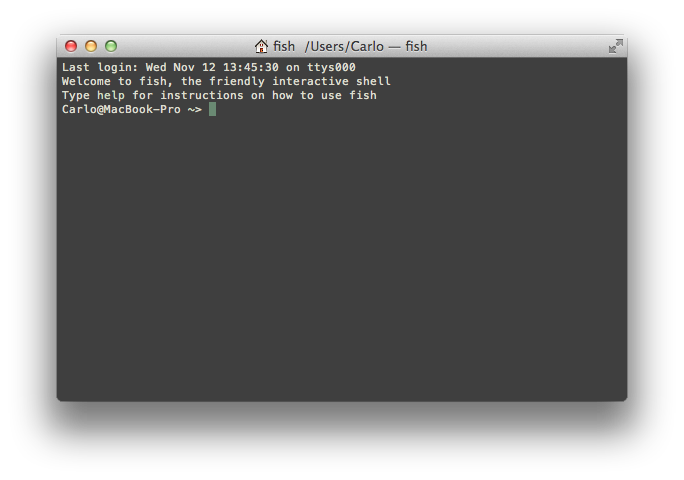
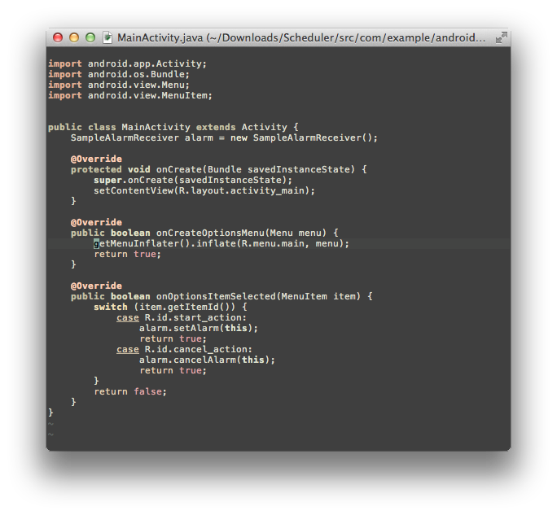
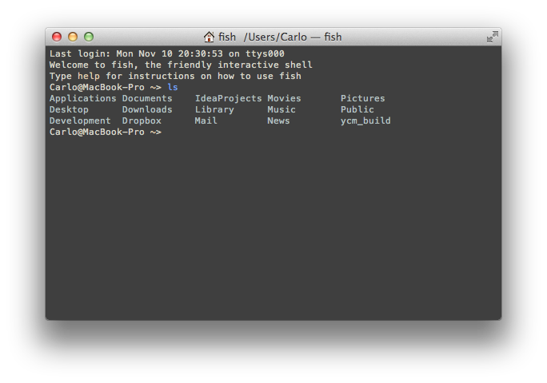
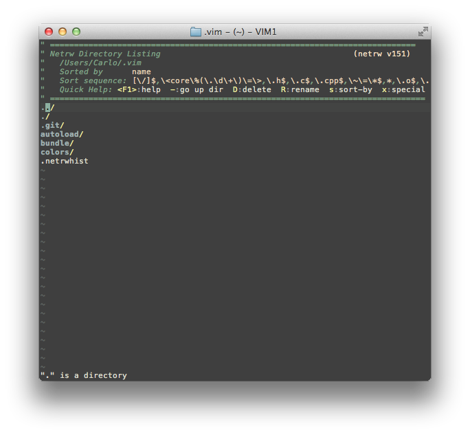
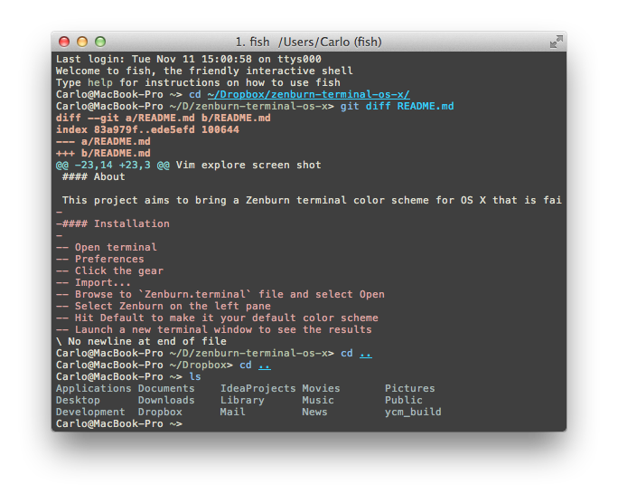

#### A screen shot is worth a thousand words

Images of terminal running [fish](http://fishshell.com/).

Another terminal screen shot

MacVim screen shot (to compare)

Terminal screen shot showing folders

MacVim explore screen shot

iTerm screen shot

#### About

This project aims to bring a Zenburn terminal color scheme for OS X based on how MacVim looks with Zenburn color scheme for Vim.
